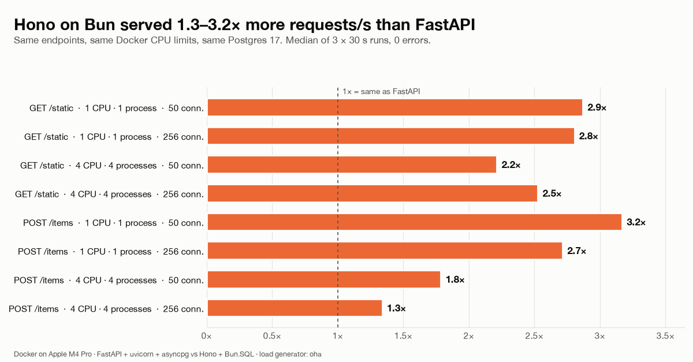

# FastAPI vs Hono on Bun: a reproducible benchmark

Two equivalent HTTP APIs, one in **FastAPI (Python 3.14)** and one in **Hono (Bun 1.4)**.
Both are load-tested with [oha](https://github.com/hatoo/oha) under identical Docker CPU and memory limits.

| Endpoint | What it measures |
|---|---|
| `GET /static` | Framework + runtime overhead: serializes a fixed 50-product list (6,960 bytes, byte-identical in both apps) on every request |
| `POST /items` | Real-world write path: JSON body validation (Pydantic vs Zod), then `INSERT ... RETURNING id` into Postgres 17 |

## Results (Apple M4 Pro, Docker Desktop)



| Scenario | FastAPI | Hono | Ratio |
|---|---:|---:|---:|
| `GET /static`, 1 CPU, 50 conn. | 23.8k req/s | 68.2k req/s | 2.9× |
| `GET /static`, 4 CPU, 256 conn. | 84.8k req/s | 214k req/s | 2.5× |
| `POST /items`, 1 CPU, 50 conn. | 8.6k req/s | 27.3k req/s | 3.2× |
| `POST /items`, 4 CPU, 256 conn. | 22.3k req/s | 29.9k req/s | 1.3× (Postgres-bound) |

Full table with p50/p95/p99, CPU and memory: [`results/summary.md`](results/summary.md). Charts: [`results/charts/`](results/charts).

📝 Full write-up with analysis and caveats: [`docs/article.md`](docs/article.md)

## Fairness rules

| | FastAPI | Hono / Bun |
|---|---|---|
| Server | uvicorn + uvloop + httptools, `--workers N`, no access log | `Bun.serve` with `reusePort`, N processes |
| JSON | `ORJSONResponse` | `c.json()` |
| Validation | Pydantic v2 | Zod 4 + `@hono/zod-validator` |
| Postgres driver | asyncpg pool | `Bun.SQL` (built in) |
| DB pool | 20 connections total, split across workers | same |

- **Round A**: 1 CPU / 1 GB, 1 process. **Round B**: 4 CPU / 2 GB, 4 processes.
- Only one app runs at a time. Postgres gets 4 CPU and oha gets 6 CPU, all on the same Docker network, so no host port-forwarding is involved.
- Every scenario gets a 10 s warmup, then 3 × 30 s measured runs; the median is reported. Concurrency is 50 and 256 connections.
- Inserts are checked after every run: the row count in Postgres must equal the number of HTTP 201 responses.
- The load generator's CPU is recorded, so you can check it never became the bottleneck.

## Reproduce

Requirements: Docker (with 12 or more CPUs available to the VM), [uv](https://docs.astral.sh/uv/).

```bash
docker compose build
./bench/run.sh                 # ~35 min; quick trial: DURATION=5s WARMUP=2s REPS=1 ./bench/run.sh
uv run analysis/report.py      # writes results/summary.md and results/charts/*.png
docker compose down -v
```

## Layout

```
fastapi_app/   FastAPI service (main.py, pinned requirements.txt)
hono_app/      Hono service (src/index.ts, src/cluster.ts, bun.lock)
data/          fixed products.json served by both apps
db/init.sql    items table
bench/         oha image, run.sh, POST payload
analysis/      report.py -> summary table + charts
results/       raw oha JSON, docker stats samples, summary
docs/          write-up (docs/article.md) and its chart images
```

## Caveats

- This is Docker Desktop on macOS: absolute numbers differ from bare-metal Linux, but both apps pay the same tax.
- These are synthetic endpoints. Real apps spend time on business logic, ORMs, auth, and I/O to other services.
- Everything runs on a single machine, so the client, server and database share one CPU package.

## License

[MIT](LICENSE)
