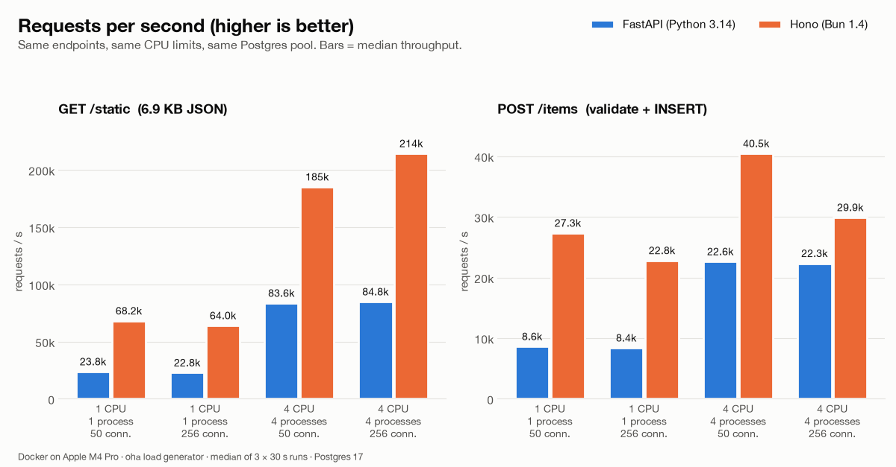
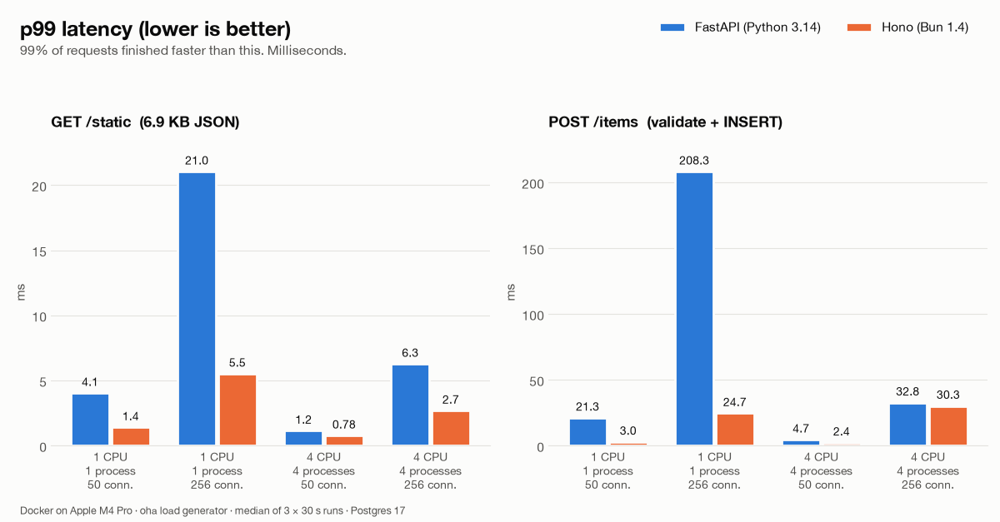
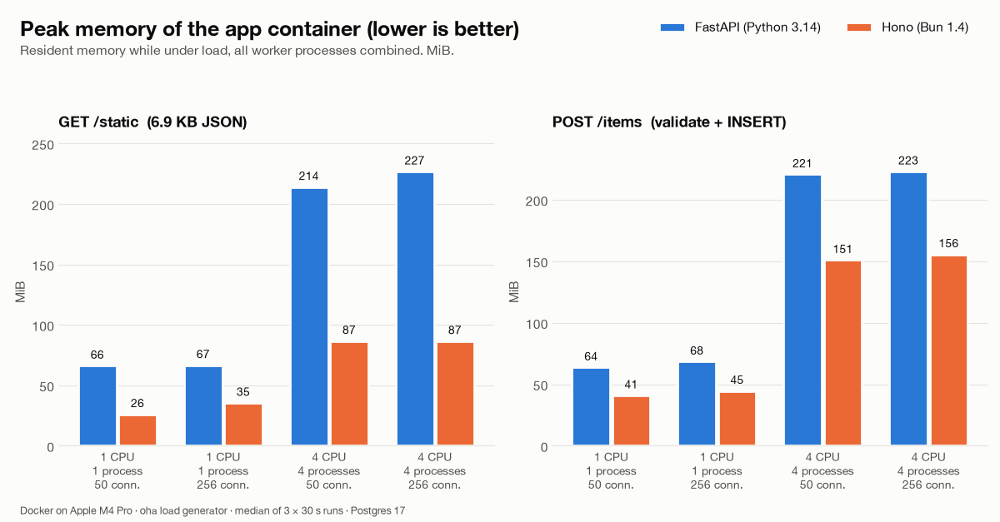

# FastAPI vs Hono on Bun: I load-tested both against Postgres. Here are the real numbers


"Bun is 3× faster" makes a nice tweet. But most of us don't ship hello-world endpoints. We ship APIs that validate JSON and write to Postgres. So I built the same small API twice, once in **FastAPI (Python 3.14)** and once in **Hono on Bun 1.4**, and load-tested both under identical conditions.

TL;DR: Hono on Bun had higher throughput in every scenario, by **1.3× to 3.2×**. It also had lower p99 latency and used less memory. But it did not win *every* metric, and the most interesting findings are *where the gap closes* and where FastAPI came out ahead.

---

## What I tested

Two endpoints, implemented the same way in both apps:

- **GET /static**: returns a fixed list of 50 products (6,960 bytes of JSON). The JSON is serialized on every request, and the response is byte-identical in both apps (I checked the SHA-256). This measures pure framework + runtime overhead.
- **POST /items**: validates the JSON body (Pydantic v2 vs Zod 4), then runs `INSERT ... RETURNING id` into Postgres 17. This is the "real API" path: parsing, validation, driver, connection pool and event loop.

## How I kept it fair

- **Best-practice stack on both sides.** FastAPI ran on uvicorn with uvloop, httptools and orjson responses, with the asyncpg pool. Hono ran on `Bun.serve` with the built-in `Bun.SQL` Postgres client.
- **Same limits.** Everything ran in Docker with hard CPU and memory limits:
  - **Round A:** 1 CPU, 1 process.
  - **Round B:** 4 CPUs, 4 processes (uvicorn `--workers 4` vs 4 Bun processes sharing the port via `SO_REUSEPORT`).
- **Same database pool:** 20 Postgres connections in total per app, split across workers.
- **Isolation:** only one app ran at a time. The load generator ([oha](https://github.com/hatoo/oha)) ran inside the same Docker network with its own 6 CPUs, and it peaked at 219% of that, so it was never the bottleneck.
- **Repeatable runs:** a 10 s warmup, then 3 × 30 s runs per scenario, median reported. Concurrency was 50 and 256 connections.
- **Integrity check:** after every insert run, the row count in Postgres had to equal the number of HTTP 201 responses. Across 24 insert runs and 16.7 million rows the difference was **0**, and every run had **0 errors**.

---

## Result 1: Static JSON, Hono is 2.2–2.9× faster



- **1 CPU:** FastAPI **23.8k req/s**, Hono **68.2k req/s** (2.9×)
- **4 CPUs:** FastAPI **84.8k req/s**, Hono **214k req/s** (2.5×)

This is the raw runtime difference: JavaScriptCore plus Bun's Zig HTTP server versus CPython plus uvicorn. Both apps ran at or near their CPU limit, so each was doing as much work as its CPU allowed.

## Result 2: Postgres inserts on 1 CPU, Hono is 3.2× faster

- FastAPI: **8.6k inserts/s**
- Hono: **27.3k inserts/s**

I expected the database to even things out. It didn't, because on 1 CPU the app, not Postgres, is the bottleneck. FastAPI's single worker was at 100% CPU while Postgres sat at 65%. Hono's single process pushed Postgres to 165%.

**One Hono process on 1 CPU (27.3k/s) did more inserts than FastAPI with 4 workers on 4 CPUs (22.6k/s).**

## Result 3: Tail latency is where users feel it



At 256 concurrent connections on 1 CPU, the insert endpoint's p99 latency was:

- FastAPI: **208 ms**
- Hono: **25 ms**

That's an 8× difference in the slowest 1% of requests, and those requests are the ones that trigger timeouts and retries.

## Result 4: With 4 CPUs the gap shrinks to 1.3–1.8×, and Postgres becomes the limit

- 50 connections: FastAPI **22.6k/s**, Hono **40.5k/s** (1.8×)
- 256 connections: FastAPI **22.3k/s**, Hono **29.9k/s** (1.3×)

FastAPI was still CPU-bound: its 4 workers used their entire 4-CPU limit. Hono only used about 2.4–3.2 of its 4 CPUs, which means it was **waiting on Postgres**. Postgres was writing hard enough to run WAL-triggered checkpoints back to back, and Hono's run-to-run spread grew (27.7k–33.7k).

**Lesson:** once your app is fast enough, the database becomes the ceiling, and a faster framework can't lift it.

## Result 5: Memory



- **1 process:** FastAPI 64–68 MiB, Hono 26–45 MiB
- **4 processes:** FastAPI 214–227 MiB, Hono 87–156 MiB

## Result 6: Where FastAPI did better

Hono did not win everything. Two findings go the other way.

**1. Median latency under overload.** With inserts on 1 CPU and 256 connections:

- FastAPI: p50 **4.1 ms**, p95 128 ms, p99 208 ms
- Hono: p50 **8.6 ms**, p95 24 ms, p99 25 ms

FastAPI's typical request was twice as fast. Its tail, though, was huge: a smaller group of requests waited 100–200 ms. Hono spread the waiting evenly, so every request took roughly the same time. Which is better depends on what you care about. Users usually feel the tail, because slow requests are the ones that hit timeouts and trigger retries. Still, on the median, FastAPI won this one.

**2. Run-to-run stability.** FastAPI's throughput barely moved between runs. For example, inserts on 1 CPU ranged from 8,186 to 8,431 req/s, about ±1.5%. Hono's insert runs varied far more: 21,707 to 29,837 req/s in the same scenario. The most likely reason is that Hono was fast enough to push Postgres into heavy write mode (I saw back-to-back checkpoints in the Postgres log), so its throughput followed the database's hiccups. FastAPI was limited by its own CPU, which made it slower but very predictable. (Hono's *worst* run was still faster than FastAPI's *best*.)

**And one near-tie:** inserts on 4 CPUs at 256 connections had almost identical latency. FastAPI measured p95 23.8 ms and p99 32.8 ms, and Hono measured p95 23.6 ms and p99 30.3 ms. Both were waiting on the same database.

---

## So which one should you pick?

**Choose Hono + Bun when:**
- You need high throughput per CPU, such as API gateways, BFFs, webhooks or high-traffic CRUD. Roughly 3× less CPU for the same load is a real cloud bill.
- Your team is already on TypeScript and wants one language front to back.
- Tail latency (p95/p99) under load matters to you.

**Choose FastAPI when:**
- Your API sits next to Python's ecosystem: ML models, data pipelines, pandas, scientific libraries.
- Your bottleneck is the database or external services. As Results 4 and 6 show, the gap then shrinks quickly.
- Predictable, steady throughput matters more to you than peak numbers.
- You value Pydantic's mature validation, the automatic OpenAPI docs, and a large hiring pool.

The most useful takeaway isn't "X is faster". It's this: **measure where your time actually goes.** With 1 CPU the framework was the bottleneck. With 4 CPUs it was Postgres. Your production API has its own bottleneck, and only a load test tells you which one it is.

## Limitations (please read before quoting numbers)

- It ran on Docker Desktop on an Apple M4 Pro. Absolute numbers on bare-metal Linux will differ, but both apps paid the same virtualization tax.
- These are synthetic endpoints. Real handlers do auth, business logic, ORMs and calls to other services, which usually narrows the gap.
- The insert result compares whole stacks. Part of the difference comes from the driver (asyncpg vs Bun.SQL), not just the framework.
- FastAPI was tested on its fast path (orjson, uvloop, httptools). I did not measure it with default settings.
- Everything ran on a single machine, so client, server and database shared one CPU package.

## Reproduce it yourself

All code, raw results and scripts are open source, and one command runs the whole benchmark:

👉 **https://github.com/vitalii-js/fastapi-vs-bun-hono-benchmark**

```
docker compose build
./bench/run.sh
uv run analysis/report.py
```

If you get different numbers on your hardware, I'd love to see them in the comments.

#FastAPI #Bun #Hono #Python #TypeScript #Backend #Performance #PostgreSQL #WebDevelopment
